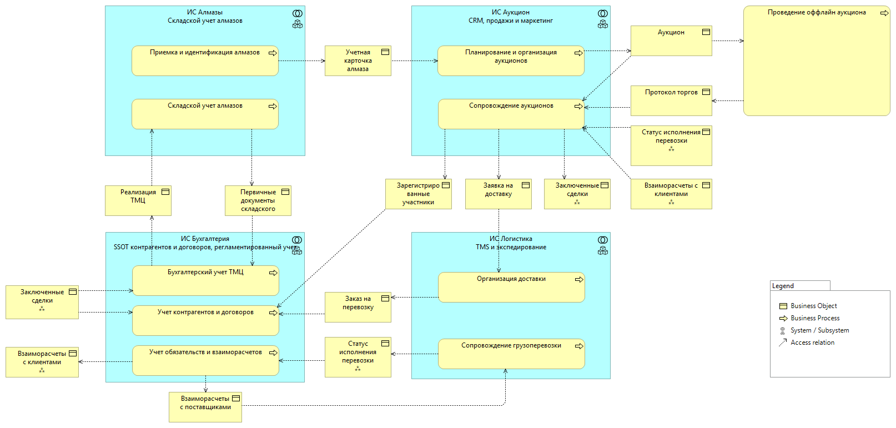

# Обзор текущей ИТ-инфраструктуры Diamond Universe

## Базовый контекст

На текущий момент автоматизировано все, что предшествует аукциону, и следует за ним, а сам аукцион полностью физический.
ИТ-ландшафт состоит из следующих систем и автоматизированных бизнес-процессов:

### ИС Алмазы

**Назначение** системы — оперативный складской и номерной учет алмазов:

- оприходование камней от производства, их идентификация и сортировка;
- номерной учет алмазов;
- складской учет хранения алмазов и их движений по местам хранения.

Автоматизируемые **процессы**:

1. **Приемка и идентификация алмазов**:
   - после добычи каждый алмаз взвешивается, фотографируется, обмеряется;
   - алмазам присваиваются уникальные идентификацонные номера и в системе сохраняется "Учетная карточка алмаза" с фото, результатами обмеров, датой и местом добычи и иной номенклатурой;
   - эксперты оценивают пригодность алмазов к производству бриллиантов и сортируют камни по критерию "ювелирный/промышленный";
2. **Складской учет алмазов**:
   - после идентификации, обмеров и сортировки алмазы перемещаются на места долгосрочного хранения;
   - переда началом аукциона запланированные к продаже лоты перемещаются в аукционное хранилище, откуда возвращаются на склад сразу после окончания осмотра экспертами-участниками;
   - по окончанию торгов покупатели или транспортная комапния на основании заключенных договоров купли-продажи забирают купленные алмазы со склада.

**Интегрирована** с:

1. ИС Аукционы:
   - отправляет учетные карточки новых ювелирных алмазов для планирования аукционов
2. ИС Бухгалтерия:
   - отправляет первичные документы складского учета;
   - получает раходные документы, на основании которых производится выдача товара покупателям/транспортникам;

### ИС Аукцион

**Назначение** системы - CRM, продажи и маркетинг:

- планирование аукционов и рекламных компаний под них;
- рассылка приглашений, регистрация участников аукционов;
- организация и сопровождение проведения оффлайн-аукционов;

Автоматизируемые **процессы**:

1. **Планирование и организация аукционов**:
   - аукционисты отбирают камни из ИС «Алмазы», соблюдая баланс по общему количеству и пропорции камней высокого и низкого интереса, группируют их в коллекции (где одна коллекция равна одному аукциону), конвертируют учетные карточки в лоты ИС «Аукцион» и назначают начальные цены.
   - аукционисты регистрируют планируемые аукционы в ИС «Аукцион», настраивают публикацию сведений о них на сайте компании и отправку уведомлений потенциальным покупателям, регистрируют откликнувшихся будущих участников.
   - в ходе регистрации участников на предстоящие аукционы аукционист организовывает заключение договора задатка с клиентом;
2. **Сопровождение аукционов**:
   - перед началом аукциона аукционисты формируют заявку на склад для физического перемещения сформированных лотов из основного хранилища в специализированное аукционное хранилище, подготавливая камни для последующего очного осмотра экспертами. По окончанию осмотра, соответственно, формирует обратную заявку.
   - перед началом аукциона для всех зарегистриованных экспертов аукционист организовывает оформление пропусков в специализированное аукционное хранилище для осуществления предпродажного осмотра камней;
   - по завершении аукциона аукционисты регистрируют в системе финальную цену и покупателя для каждого лота.
   - аукционист организовывает заключение договора купли-продажи с покупателями и доставку в случае необходимости.

**Интегрирована** с:

1. ИС Алмазы:
   - получает учетные карточки новых алмазов для формирования из них лотов и планирования продаж;
   - отправляет заявки на перемещение между основным складом и аукционным хранилищем;
2. ИС Логистика:
   - отправляет заявки на доставку, на основании которых логисты заключают с клиентом договор грузоперевозки и исполняют его;
   - получает информацию об отслеживании перевозок по заявкам на доставку;
3. ИС Бухгалтерия:
   - отправляет зарегистрированных участников для заключения договров задатка;
   - отправляет заключенные сделки для заключения договоров купли-продажи;
   - получает состояние взаиморасчетов с клиентами для контроля оплаты сделок и авансов;

### ИС Логистика

**Назначение** системы — TMS и автоматизация бизнес-процессов экспедирования грузов:

- логист организовывает заключение договора доставки;
- логист организовывает и исполняет доставку груза;
- специалист по документальному оформлению организовывае обмен первичными документами меджу участниками доставки;

Автоматизируемые **процессы**:

1. **Организация доставки**:
   - логист связывается с грузоотправителем и грузополучателем, уточняет адреса доставки, детали оформления и получает необходимые документы для отправки;
   - логист планирует маршрут доставки, организует фрахт и букинг, подготавливает документы для пересечения границы (если требуется международная доставка);
2. **Сопровождение грузоперевозки**:
   - по ходу выполнения доставки логист контролирует физическое движение груза по маршруту и отслеживает статусы таможенного оформления;
   - по завершению доставки специалист по документальному оформлению организует обмен закрывающими документами с клиентом, перевозчиками и иными организациями, участвовавшими в перевозке

**Интегрирована** с:

1. ИС Аукцион:
   - получает заяки на доставку для заключения договора грузоперевозки и организации доставки;
   - отправляет статусы продвижения груза по маршруту и процедурам таможенного оформления;
2. ИС Бухгалтерия:
   - отправляет заказы на грузоперевозку для заключения договоров на грузоперевозку;
   - отправляет статусы продвижения груза по маршруту и процедурам таможенного оформления для начисления и зачета задолженностей и обязательств;
   - получает состояние взамиорасчетов с поставщиками для контроля взаиморасчетов со сторонними перевозчиками и экспедиторами;

### ИС Бухгалтерия

**Назначение** системы — SSOT контрагентов и договоров, регламентированный учет:

- является мастер-системой для учета контрагентов, договоров, состояния обязательтв;
- осуществляет бухгалтерский учет в целях составления регалментированной отчетности;

Автоматизируемые **процессы**:

1. **Бухгалтерский учет ТМЦ**:
   - регистрация бухгалтерских проводок, отражающих поступление, внутреннее перемещение и списание алмазов на основании первичных документов и данных оперативного учета из ИС «Алмазы»;
   - сведение, хранение и периодическая переоценка агрегированных данных о количественных и стоимостных остатках алмазов на различных местах хранения;
2. **Учет контрагентов и договоров**:
   - регистрация, верификация и актуализация реквизитов и данных юридических и физических лиц, с которыми взаимодействует компания;
   - создание, хранение и ведение реестра договоров с обязательной привязкой к соответствующим контрагентам и условиям сотрудничества;
3. **Учет обязательств и взаиморасчетов**:
   - отражение в системе кредиторской и дебиторской задолженности на основании первичных документов, актов и условий договоров;
   - регистрация факта входящих и исходящих платежей по расчетным счетам компании на основании банковских выписок и платежных поручений;
   - привязка и распределение поступивших или списанных денежных средств на ранее начисленные задолженности по конкретным договорам и счетам;

**Интегрирована** с:

1. ИС Алмазы:
   - получает первичные документы складского учета для ведения агрегированного регламентированного учета ТМЦ;
   - на основании заключенных договоров купли-продажи отправляет документы реализации, которые являются основанием для отгрузки;
2. ИС Аукцион:
   - получает зарегистрировавшихся участников планируемого аукциона для оформления договоров задатка;
   - отправляет заключенные договоры задатка;
   - получает заключенные в ходе торгов сделки для оформления договоров купли-продажи;
   - отправляет оформленные договоры купли-продажи для подписания;
   - отправляет состояние взаиморасчетов с клиентами в моменты начисления задолженностей и привязки оплат;
3. ИС Логистика:
   - получает заказы на перевозку для оформления договоров грузоперевозки;
   - отправляет оформленные договоры грузоперевозки;
   - получает статусы продвижения груза по маршруту и процедурам таможенного оформления для начисления и зачета задолженностей и обязательств;
   - отправляет состояние взамиорасчетов с поставщиками для контроля взаиморасчетов со сторонними перевозчиками и экспедиторами;

### Диаграмма исходного контекста

На диаграмме приведены ИС, происходящие в них процессы и потоки данных между ними.

> 👆 Некоторые объекты на схему помещены несколько раз для того, чтобы ислючить пересечения стрелок, которые радикально снизят читабельность.
> Символом ⁂ помечены элементы, которые на схеме присутствуют в нескольких местах: одинаковая комбинация стереотипа и названия означает одинаковый объект.

## Болевые точки (технические и процессные ограничения)

**Процессные ограничения:**

1. **Отсутствие цифрового канала сбыта:** Бизнес критически зависит от физического присутствия покупателей и экспертов. Пандемия разрушила эту модель, что привело к резкому падению продаж.
2. **Высокая зависимость от человеческого фактора и внешних сервисов:** Процесс уязвим из-за зависимости от конкретных сотрудников-экспертов, физических лабораторий и ручного труда при подготовке данных.
3. **Отсутствие «цифрового двойника» камня:** Нет выстроенного процесса оцифровки камней (3D-сканирование, фиксация характеристик) и публикации этих данных для принятия решений покупателями удаленно.
4. **Жесткие временные рамки:** Стандартный ИТ-цикл (сбор требований, согласования, разработка, тестирование, релиз) слишком долог, чтобы запустить полноценное решение за 2 месяца.

**Технические ограничения:**

1. **Неготовность основных систем к онлайну:** ИС «Аукцион» не поддерживает онлайн-формат торгов и не имеет функционала публикации каталогов для клиентов.
2. **Отсутствие интеграций с новыми участниками:**
    * Нет обмена данными с новой внешней ИС «Лаборатория» (необходимо для получения результатов оцифровки).
    * Нет интеграции с облачными сервисами провайдера (необходимо для публикации данных клиентам).
3. **Неполное покрытие новых процессов в обеспечивающих системах:**
    * ИС «Алмазы» не предполагает наличия внешних исполнителей и отслеживания статуса исполнения внешнего процесса в ходе идентификации, которые нужны для осуществления ислледований силами внешнего подрядчика.
    * ИС «Алмазы» учетная карточка алмаза не предназначена для хранения всего объема данных, которые сосотавляют цифровой двойник алмаза.
    * Отсутствует в принципе ИС для проведения онлайн-торгов.
4. **Ручные операции (для промежуточного решения):** Из-за нехватки времени придется использовать Excel и ручные операции для подготовки данных, что создает риски ошибок и неэффективного использования ресурсов.
