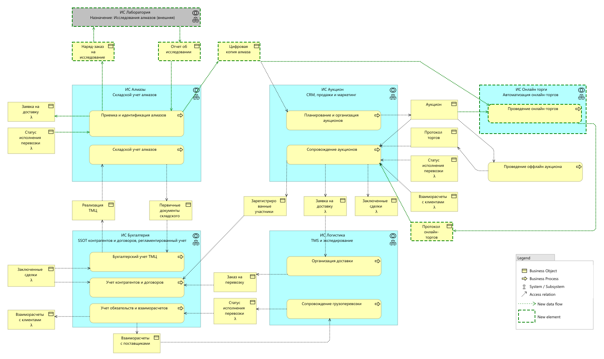

# Целевое состояние

На диаграмме ниже приведено цеелвое состояние информационных систем и потоков данных.
Диаграмма сформирована на базе исходной путем добавления новых элементов с максимальным переиспользованием уже
имеющихся потоком, объектов и функций:

- Зеленым цветом выделены новые объекты, потоки данных, процессы и системы, которые предполагается создать в ходе
   реализации данного решения;
- Серым выделены внешние системы, которые используются, как поставщики данных;

> 👆 Некоторые объекты на схему помещены несколько раз для того, чтобы ислючить пересечения стрелок, которые радикально
> снизят читабельность. 
> Символом λ помечены элементы, которые на схеме присутствуют в нескольких местах: одинаковая комбинация стереотипа и
> названия означает одинаковый объект. 
> Иными словами, если видите λ, значит этот объект есть где-то еще на схеме и это один и тот же объект.

> ⚠️ на диаграмме и в описаниях ниже сознательно совмещены понятия "бизнес объект" и "поток данных"
> для упрощения картины и облегчения повествования: на текущем уровне детализации эти понятия используются, как синонимы.

## Характеристика отличий целевого состояния

1. Учетная карточка расширяется и преобразовывается в "Цифровой двойник алмаза". Это новый объект, но онполучатся путем
   обратно совместимого расширения уже имеющейся карточки, что позволит минимизировать потребоность в доработках
   существующих потоков данных.
2. Для формирования цифрового двойника мы подключаем внешнюю ИС "Лаборатория", соответственно, создаем два новых потокы
   данных:
   - "Наряд-заказ на исследование" - мы отправляем в лабораторию идентифицированные камни для проведения исследований;
   - "Отчет об исследовании" - лаборатория для каждого камня передает результаты исследований, которые лягут в основу
      цифрового двойника.
3. Для обеспечения транспортировки алмазов в лабораторию и обратно мы переиспользуем уже имеющийся поток
   "Заявка на доставку". Для ИС "Логистика" появляение лаборатории — это количественное, а не качественное изменение,
   по этому ничего не мешает использовать уже имеющиеся в ней функции транспортировки так же, как они бы использовались
   для локальной доставки алмазов покупателям.
4. Поскольку ИС "Алмазы" отправляет камни на внешнюю экспертизу, в ней появляется необходимость отследивать эти
   перемещения, для этого мы переиспользуем имеющийся поток "Статус исполнения перевозки",направляя его в ИС "Алмазы".
5. Для проведения, собственно, самих онлайн-аукционов мы добавляем новую ИС "Онлайн торги", в которой будет
   инкапсулирована вся механика связанная со ставками, началом и окончанием торгов, определением победителя. Эта система
   интегрируется с ИС "Аукцион" и получет из него все уже имеющиеся в ней сведения об аукционах, лотах,
   зарегистрированных участниках. Эти потоки данных полностью новые. Название системы образовано от слова "торги", чтобы
   подчеркнуть назначение: в этой системе автоматизируется только та часть аукциона, которая связана непосредсвенно с
   торгами, а планирование и сопровождение остаются в ИС Аукцион в прежнем объеме.
6. В ИС "Аукцион" появляется новый поток данных "Протокол онлайн-торгов". Он по смыслу аналогичен тем данным, что
   вносятся вручную по результатам оффлайн-торгов, и используется для тех же целей: инициировать заключения договоров
   и организации доставки. Сами по себе эти процессы организации используются точно те же, что и для оффлайн торгов.
7. Возможность проведения оффлайн-аукционов полностью сохраняется в том числе и для того, чтобы снизить стоимость
   перехода к внедрению онлайн-аукционов за счет переиспользования старых, уже всем знакомых процессов и форматов.
